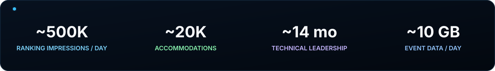
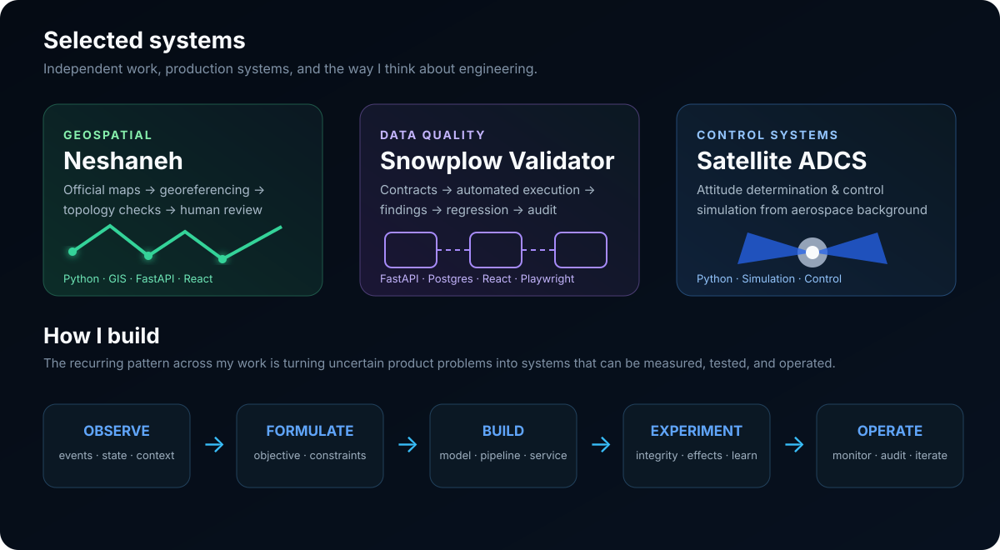

  

  <a href="https://www.linkedin.com/in/arashsafari95/"><b>LinkedIn</b></a>
  &nbsp;&nbsp;·&nbsp;&nbsp;
  <a href="mailto:ArashXSafari@gmail.com"><b>Email</b></a>
  &nbsp;&nbsp;·&nbsp;&nbsp;
  <a href="https://github.com/ArashXSafari"><b>GitHub</b></a>

  I build production machine-learning and search systems for marketplace products. 
  My strongest work sits at the boundary between <b>modeling</b>, <b>systems engineering</b>, and <b>decision-making under uncertainty</b>.

  

  

## Production work

I have worked across the full path from instrumentation and data infrastructure to search, ranking, personalization, optimization, experimentation, and production operation.

- **Search & ranking:** production ranking systems, MapRank, relevance logic, Go + Elasticsearch search infrastructure.
- **Decision systems:** constrained marketplace ranking interventions, hourly PySpark optimization, auditable decision state, feedback/control-style formulations.
- **Personalization:** Spark Structured Streaming + Kafka scoring infrastructure around user/item representations.
- **Experimentation:** A/B testing, experiment-integrity checks, assignment/delivery diagnostics, online/offline evaluation.
- **Data systems:** Snowplow, Spark, Kafka, Airflow, Hive/HDFS, Delta Lake, ClickHouse, production observability.
- **Leadership:** approximately 14 months leading Data and Ranking teams while remaining technically hands-on.

## Selected production systems

### MapRank
Solely designed and implemented from an interactive algorithm sandbox through the production Go search-service module for viewport-aware pin ranking, collision handling, adaptive clustering, and configuration-driven display budgets.

### Guarantee-ranking controller
Built a live controller that translates marketplace financial state into constrained ranking interventions using hourly PySpark optimization, feasibility checks, auditable Delta decision logs, and Kafka publication.

### Booking / close hazard framework
Designed a discrete-time formulation connecting exposure, booking probability, and expected marketplace P&L, with a preliminary prototype on approximately 2.48M observations.

### Personalization infrastructure
Engineered Spark Structured Streaming/Kafka scoring infrastructure around inherited user/item representations, including stateful event handling, vector scoring, top-K generation, and production-oriented fallback paths.

## Core stack

<table>
<tr>
<td width="20%"><b>Languages</b> Python SQL Go</td>
<td width="20%"><b>ML</b> Ranking Recommenders Personalization Survival / hazard</td>
<td width="20%"><b>Data systems</b> Spark Kafka Airflow Hive / Delta</td>
<td width="20%"><b>Search & services</b> Elasticsearch FastAPI GraphQL REST APIs</td>
<td width="20%"><b>Engineering</b> Docker Linux Git / CI-CD Monitoring</td>
</tr>
</table>

## Background

B.Sc. in Aerospace Engineering from K. N. Toosi University of Technology. My control and systems background continues to influence how I approach ranking, online decision-making, and marketplace optimization problems.

> I am most interested in engineering systems that make difficult decisions measurable, testable, and operable in the real world.
